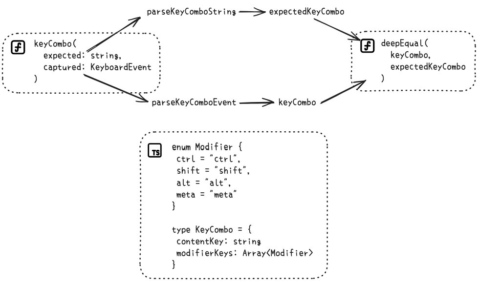

# keycombo-parse

## Introduction

When `alt` key is involved in to key combination, the value of `e.key` becomes strange. For example, hitting `⌥ + A`, you'll get `å` as `e.key` value. The `e.code` value is more accurate in this case: `KeyA`, but a bit lengthy.

While registering a keyboard shorcut event, devolopers want something like this:

```js
import kc from "keycombo-parse"

document.addEventListener("keydown", e => {
	if (kc("⇧ ⌥ ⌘ + C", e)) {
		// shortcut activated
	}
})
```

The key combination string: `⇧ ⌥ ⌘ + C`, is quite succinct, but might be hard to type for those not using a text expander such as espanso. In this package we also support key combo string in plain text: `shift alt meta + C`.

## How to use

After installation with `pnpm add keycombo-parse`, you could import it to browser client-side JavaScript code:

```js
// using the default export
import isKeyComboMatch from "keycombo-parse"

document.addEventListener("keydown", e => {
	if (isKeyComboMatch("⇧ ⌥ ⌘ + H", e)) {
		showHelp()
	}
})

const showHelp() => console.log("Displaying help dialog...")
```

or get the standardized keycombo string:

```js
import { standardKeyCombo } from "keycombo-parse"

standardKeyCombo(" cmd shift option + k") // log output: ⇧ ⌥ ⌘ + K
```

if you want have a shortcut that requires hitting content key twice, define it this way:

```js
import isKeyComboMatch from "keycombo-parse"

document.addEventListener("keydown", e => {
	if (isKeyComboMatch("⌘ + C", e)) {
		copyName()
	} else if (isKeyComboMatch("⌘ + CC", e)) {
		copySVG()
	}
})

const copyName = () => console.log("Copying icon name...")
const copySVG = () => console.log("Copying icon SVG...")
```

## Restriction

A few things to note:

- We use space as separator, so spaces are necessary
- We recognize `alt`, `option`, or `⌥`, all supported!
- We avoid differentiating modifier keys on the right side, so `ShiftLeft` and `ShiftRight` are treated as the same
- Case-insensitive, so `Alt` and `alt` are both acceptable
- It's recommended that key combination always end with a non-modifier key, for example: `⌘ + C`, `⌘ + 1`, or `⌘ + [`
- A single non-modifer key are supported only when user not typing into a text field
- A single modifer key: `shift`, `alt`, `meta`, `ctrl` are also supported
- Function keys are not supported

## Idea behind this package



## `e.code` and its alternatives

When naming the key combo string, you can use the complete key code name, for example: `Shift Meta + KeyC`, or the more concise couterpart: `⇧ ⌘ + C`.

### content key: number

- Digit0: `0`, `)`
- Digit1: `1`, `!`
- Digit2: `2`, `@`
- Digit3: `3`, `#`
- Digit4: `4`, `$`
- Digit5: `5`, `%`
- Digit6: `6`, `^`
- Digit7: `7`, `&`
- Digit8: `8`, `*`
- Digit9: `9`, `(`

### content key: alphabet

- KeyQ: `Q`, `q`
- KeyW: `W`, `w`
- KeyE: `E`, `e`
- KeyR: `R`, `r`
- KeyT: `T`, `t`
- KeyY: `Y`, `y`
- KeyU: `U`, `u`
- KeyI: `I`, `i`
- KeyO: `O`, `o`
- KeyP: `P`, `p`
- KeyA: `A`, `a`
- KeyS: `S`, `s`
- KeyD: `D`, `d`
- KeyF: `F`, `f`
- KeyG: `G`, `g`
- KeyH: `H`, `h`
- KeyJ: `J`, `j`
- KeyK: `K`, `k`
- KeyL: `L`, `l`
- KeyZ: `Z`, `z`
- KeyX: `X`, `x`
- KeyC: `C`, `c`
- KeyV: `V`, `v`
- KeyB: `B`, `b`
- KeyN: `N`, `n`
- KeyM: `M`, `m`

### content key: placeholder

- Space: `space`, `␣`
- Enter: `enter`, `⏎`,`↵`,`↩`, `return`
- Tab: `tab`, `⇥`

### content key: special charactor

- BracketLeft: `[`, `{`
- BracketRight: `}`, `]`
- Minus: `-`, `_`
- Equal: `+`, `=`
- Semicolon: `;`, `:`
- Comma: `,`, `<`
- Period: `.`, `>`
- Quote: `'`, `"`
- Backquote: `~`, ` (can't display normally in markdown code format)
- Backslash: `\`, `|`
- Slash: `/`, `?`

### content key: functional

- Escape: `esc`, `escape`
- Backspace: `⌫`, `backspace`, `delete`, `del`
- CapsLock: `caps`, `cap`, `capslock`, `⇪`
- ArrowUp: `arrowup`, `up`, `↑`
- ArrowDown: `arrowdown`, `down`, `↓`
- ArrowLeft: `arrowleft`, `left`, `←`
- ArrowRight: `arrowright`, `right`, `→`

### modifer key

- AltLeft: `alt`, `option`, `⌥`
- ShiftLeft: `shift`, `⇧`
- ControlLeft: `control`, `ctrl`, `⌃`
- MetaLeft: `command`, `cmd`, `⌘`, `meta`
